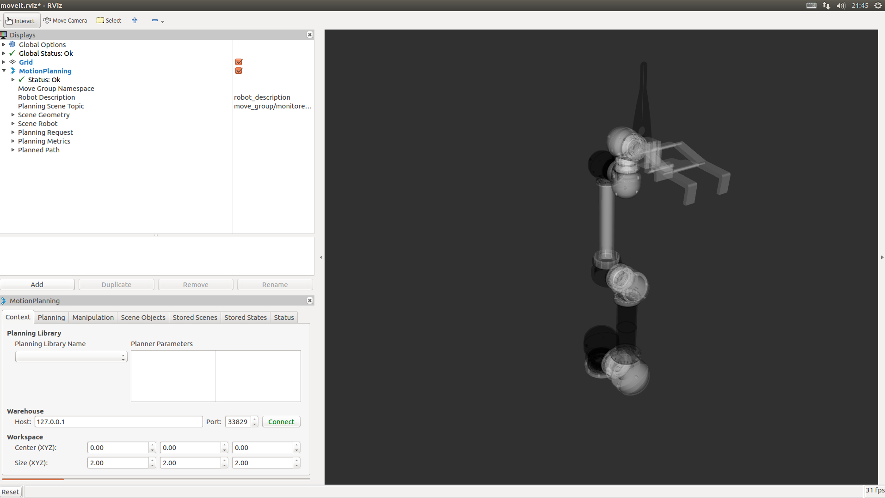
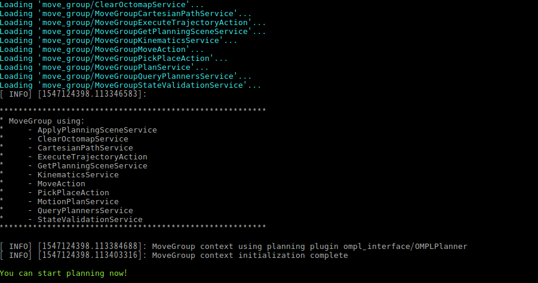
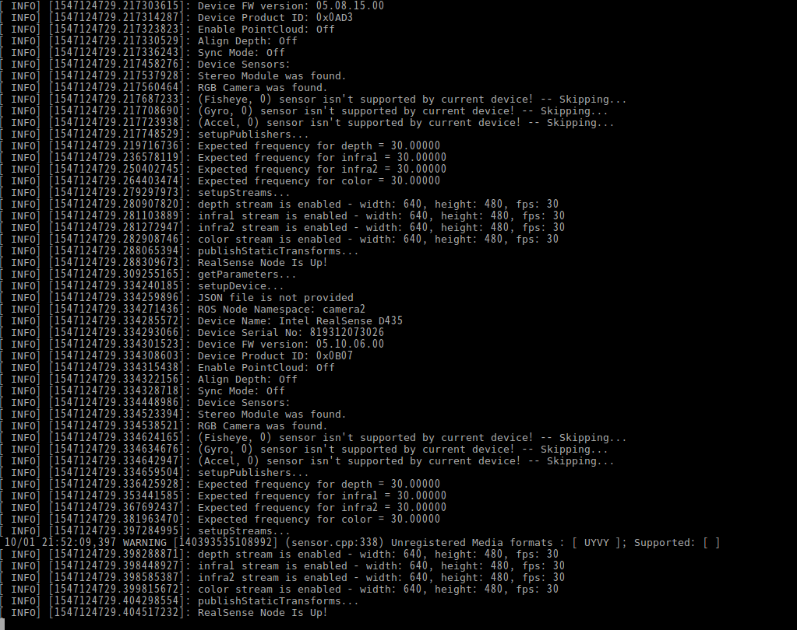
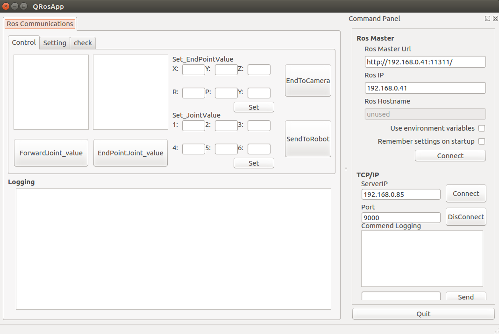
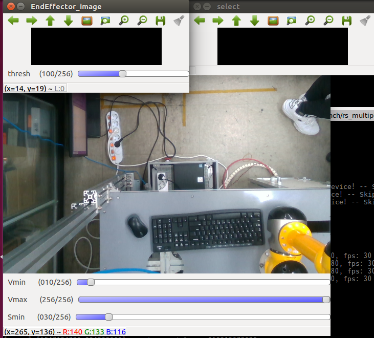
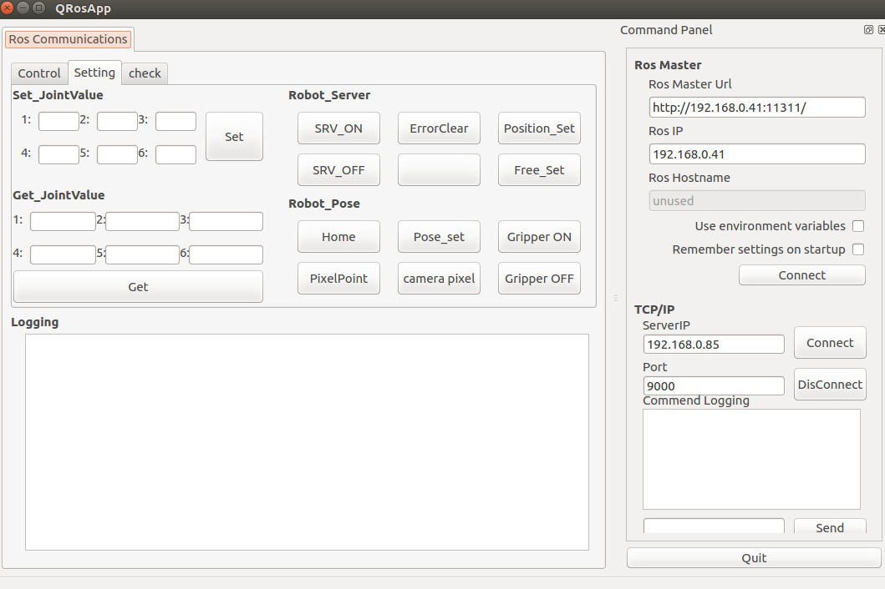
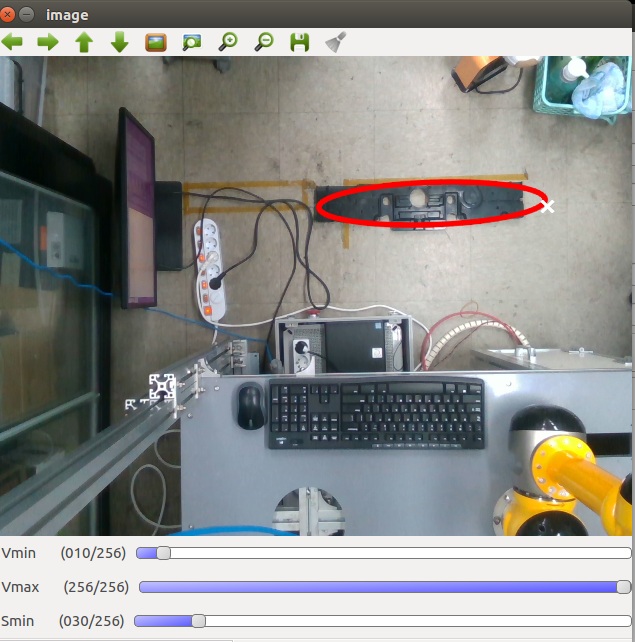

# Requirements

1. Ubuntu 16.04

2. [ROS Kinetic](http://wiki.ros.org/kinetic/Installation/Ubuntu)

3. [MoveIt!](http://docs.ros.org/kinetic/api/moveit_tutorials/html/doc/getting_started/getting_started.html)

4. OpenCV ROS Package

5. [Intel® RealSense™ SDK](https://github.com/IntelRealSense/librealsense/blob/master/doc/distribution_linux.md)

6. [Realsense ROS Package](https://github.com/intel-ros/realsense)

7. [ROS Qt Creator](https://ros-qtc-plugin.readthedocs.io/en/latest/_source/How-to-Install-Users.html#qt-installer-procedure)

8. Additional libraries

 <pre><code> 
sudo apt-get install ros-kinetic-tf2-geometry-msgs ros-kinetic-find-object-2d ros-kinetic-moveit* ros-kinetic-qt-build ros-kinetic-map-server ros-kinetic-move-base  ros-kinetic-rviz-visual-tools ros-kinetic-interactive-markers   ros-kinetic-qt-ros -y  </pre></code>

-------------

# How to run the functions for 'manipulator'

1.  Run the moveIt! and RViz

 <pre><code>
 roslaunch srdf demo.launch 
 </pre></code>
 
 

    
    

 
2.  Run the realsense cameras(camera1(D415): world camera, camera2(D435)" End-effector) 

Note: Connect the camera to the USB 3.0

 <pre><code>
roslaunch realsense2_camera rs_multiple_devices.launch serial_no_camera1:=732612061000 serial_no_camera2:=819312073026
 </pre></code>
 
 

    

 
 
3.  Run Qt GUI for controlling the manipulator

 <pre><code>
 rosrun qtros qtros
 </pre></code>
 
 

    

 
 
4.  Run image process using OpenCV 

 <pre><code>
 rosrun camera_node camera_node
 </pre></code>
 
 

    

 
 
 

-------------

# qtros GUI guide

 To be more specific, the functions of qtros node is like below:
 
 
## Control tab
 

    

 
- ROS Master
    - ROS MasterUrl: ROS MasterUrl
    - ROS IP: ROS IP
    - **Connect** : To connect for ROS Master with Qt GUI
    
- TCP/IP
    - ServerIP: IP of EC-Master
    - Port: Port of EC-Master(Default)
    - **Connect** : To connect for EC Master with Qt GUI
 
-  ForwardJoint_value: Get the joint angles in RViz.

-  EndPointJoint_value: Get the 3D position such as x, y, z and angle such as roll, pitch, yaw in RViz.

-  EndToCamera: Move the manitulator to the desired position through inverse kinematics in RViz. 

## Setting tab

    

-  Set_JointValue: Set the joint angles for moving according to absolute joint angles .

-  Get_JointValue: Get the joint angles from real manipulator.

-  Robot_Server: 
    - SRV_ON: Servo motor on
    - SRV_OFF: Servo motor off
    - Position_Set: init position setting
    - Free_Set:   Direct teaching
    
-  Robot_Pose: 
    - Home: Move to the home.
    - Pose_set: Move to the designated position 
    - PixelPoint: Track the object using image processing
    - Gripper On/OFF:   Gripper On/OFF
    

 
## Check tab

It is designed for checking repeatability of manipulator. 

-------------

# camera node guide

Drag the desired object area on image window with keeping left button of mouse.

    

# Video
- Object detection is developed using opencv3, which is implemeted in [object-detection-opencv3-ros](https://github.com/Geonhee-LEE/object-detection-opencv3-ros)

 
